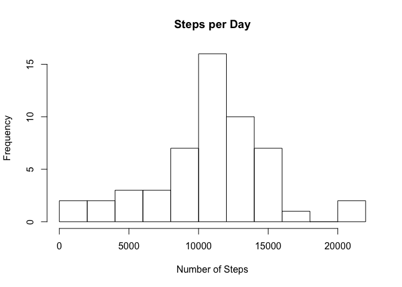
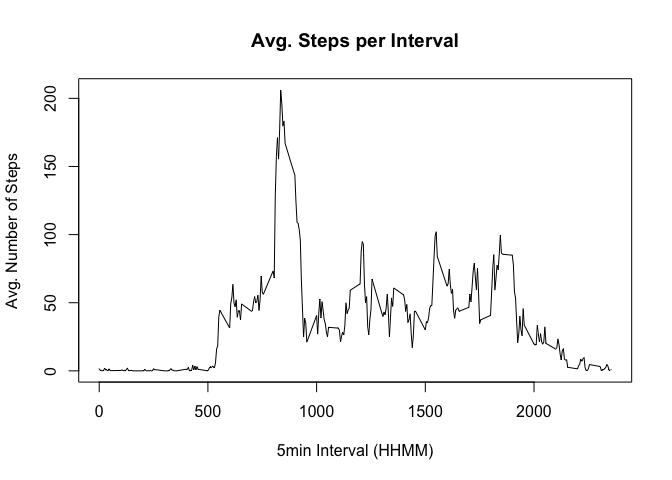
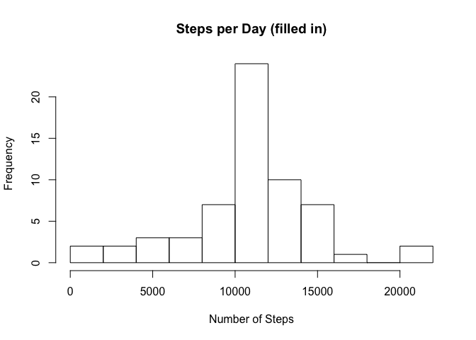
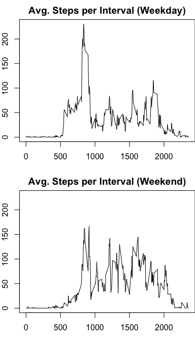

# Reproducible Research: Peer Assignment 1

This document describes a solution to the first Peer Assignment of the Reproducible Research course.

## Loading and preprocessing the data

The data is downloaded, if necessary:

```r
mydir <- "."
dataFile <- file.path(mydir, "activity.zip")
if (!file.exists(dataFile)) {
    dataURL <- "https://d396qusza40orc.cloudfront.net/repdata%2Fdata%2Factivity.zip"
    download.file(url=dataURL, destfile=dataFile, method="curl", mode="wb")
}
```
The data is unzipped and loaded into variable 'data':

```r
utils::unzip(dataFile, exdir=mydir)
dataFile <- file.path(mydir, "activity.csv")
data <- read.csv(dataFile, header=TRUE, stringsAsFactors=FALSE)
```


## What is mean total number of steps taken per day?

We clean the data by removing the `NA`s, and compute the total number of steps per day (using `tapply`):

```r
clean <- data[!is.na(data$steps), ]
stepsPerDay <- tapply(clean$steps, as.factor(clean$date), FUN=sum)
avgSteps <- mean(stepsPerDay)
medSteps <- median(stepsPerDay)
```

We can now plot the histogram of the total number of steps taken each day:

```r
hist(stepsPerDay, breaks=10, freq=TRUE, main="Steps per Day",
     xlab="Number of Steps", ylab="Frequency")
```

 

The default 10 bars and frequency y-axis work well. We see that the distribution seems roughly unimodal. The most typical activity is around 10,000 steps per day.

More precisely, the mean number of steps per day is 10766.19 and the median number of steps per day is 10765.


## What is the average daily activity pattern?

We now compute the average number of steps per 5-minute interval (using `tapply`again), and plot it to get the typical activity patern for a day:

```r
avgSteps <- tapply(clean$steps, as.factor(clean$interval), FUN=mean)
plot(names(avgSteps), avgSteps, type="l", main="Avg. Steps per Interval", 
     xlab="5min Interval (HHMM)", ylab="Avg. Number of Steps")
```

 

```r
maxInterval <- names(avgSteps)[which(avgSteps==max(avgSteps))]
```

The x-axis is the 5-minute interval, in HHMM format, so 500 is 5h00. Nothing much happens before 5h00 or after 22h00 (that's 10PM in the US of A).

The 5-minute interval that has the highest number of steps, on average, is 835, that is 8 hours and `as.numeric(maxInterval) %% 100` minutes. On average 206 are taken in that interval.

## Imputing missing values

We now identify the missing values, and count them.

```r
missing <- is.na(data$steps)
n.missing <- sum(missing)
```
There are 2304 missign values in the dataset.

Missing values are replaced with the average number of step for the corresponding period, as calculated earlier. For example, a missing value for interval "835" will be replaced by the average activity observed for 8h35 (i.e. `avgSteps["835"]`).

We put this in a new data frame called `newdata`.

```r
newdata <- data
newdata$steps[missing] <- avgSteps[as.character(data$interval[missing])]
```

Does this have an influence on the mean and median total number of steps per day, calculated above with the missing values discarded? Let's find out:

```r
newStepsPerDay <- tapply(newdata$steps, as.factor(newdata$date), FUN=sum)
hist(newStepsPerDay, breaks=10, freq=TRUE, main="Steps per Day (filled in)",
     xlab="Number of Steps", ylab="Frequency")
```

 

```r
newAvgSteps <- mean(newStepsPerDay)
newMedSteps <- median(newStepsPerDay)
```
After imputation of the missing data, the mean total number of steps is 10766.19. Not surprisingly, this has not changed as we have imputed missing values with the average. However, the median total number of steps is now 10766.19. This is different from what we had above, and in fact, it is not even an integer number of steps. Replacing missing values with the average has the artefact (in this case) of "creating" days for which the total number of days is the average, and it turns out that these become the median.


## Are there differences in activity patterns between weekdays and weekends?

Finally, we look at the difference in activity pattern between weekdays and weekends. We first identify weekdays and weekends using the `lubridate`package to identify the day of the week, then map it to `Weekday`or `Weekend`:

```r
library(lubridate)
mapDay <- c(rep("Weekday", 5), rep("Weekend", 2))
names(mapDay) <- c("Lundi", "Mardi", "Mercredi", "Jeudi", "Vendredi", "Samedi", 
                   "Dimanche")
newdata$weekday <- weekdays(ymd(newdata$date))
newdata$day <- as.factor(mapDay[newdata$weekday])
```
In the code above, we have created two new columns in the dataset to make the process clear (and debugging easier). The key column is `day`, which is a factor with two levels: `Weekday` and `Weekend`.

Now we can simply extract the part of the data corresponding to each level of the factor, and compute the activity pattern for that level:

```r
weekdayData <- newdata[which(newdata$day=="Weekday"), ]
weekendData <- newdata[which(newdata$day=="Weekend"), ]
avgWeekdaySteps <- tapply(weekdayData$steps, as.factor(weekdayData$interval), FUN=mean)
avgWeekendSteps <- tapply(weekendData$steps, as.factor(weekendData$interval), FUN=mean)
```
We then create the corresponding plot of the activity pattern for that data:

```r
par(mfrow=c(2,1))
par(mar=c(3,2,2,0))
plot(names(avgWeekdaySteps), avgWeekdaySteps, type="l",
     main="Avg. Steps per Interval (Weekday)", 
     xlab="5min Interval (HHMM)", ylab="Avg. Number of Steps")
plot(names(avgWeekendSteps), avgWeekendSteps, type="l", ylim=c(0,230),
     main="Avg. Steps per Interval (Weekend)", 
     xlab="5min Interval (HHMM)", ylab="Avg. Number of Steps")
```

 

The activity patterns differ markedly. Weekend activity starts (and ends) later, and is more uniformly distributed over the day, but the morning peak is clearly much more pronounced for weekdays.

THE END.

